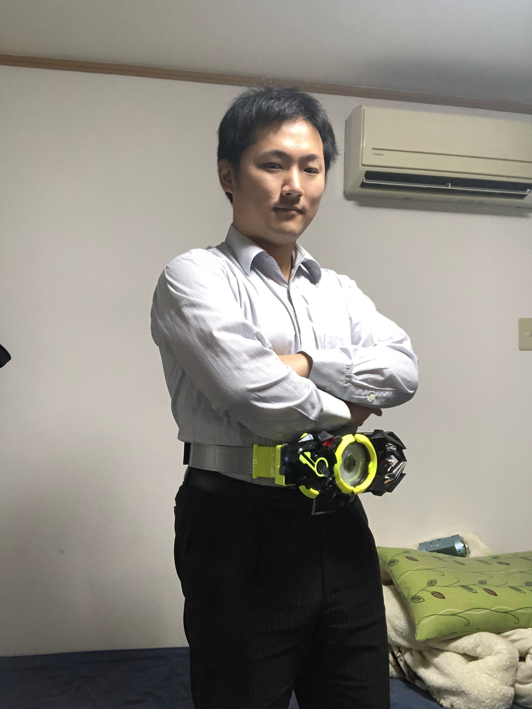

+++
menu = "main"
title = "About"
type = "about"
weight = 10
+++

# 安心してください。AWS認定SA プロフェッショナルですよ。

## background

<dl>
  <dt><strong>1990年1月19日</strong></dt>
  <dd>豊中市にて宮田家長男爆誕。"銀四郎"、"ターボ"などの候補を退け、"勝利"と名を授かる</dd>
  <dt><strong>1996年4月1日</strong></dt>
  <dd>豊中市立南桜塚小学校に入学</dd>
    <dt><strong>2000年9月某日</strong></dt>
  <dd>シスター・プリンセスにガンハマりし、人並みの青春を失う
    <dt><strong>2002年4月1日</strong></dt>
  <dd>豊中市立第一中学校に入学</dd>
  <dt><strong>2005年3月某日</strong></dt>
  <dd>シスター・プリンセスのコンテンツ終了と共に、ネットゲームの世界へガンハマり、高校受験に失敗</dd>
  <dt><strong>2006年1月某日</strong></dt>
  <dd>高校卒業認定試験に合格し、大学受験までの2年間を全てネットゲームとアルバイトに費やす</dd>
  <dt><strong>2008年4月1日</strong></dt>
  <dd>大阪学院大学 企業情報学部に入学。失った青春を取り戻すべく、彼女作りに勤しむ</dd>
    <dt><strong>2011年1月某日</strong></dt>
  <dd>1年以上にもおよぶ就職活動の末、エクストランスCS(旧オーエフ･テック)に内定</dd>
    <dt><strong>2012年4月1日</strong></dt>
  <dd>エクストランスCSに入社</dd>
    <dt><strong>2016年5月28日</strong></dt>
  <dd>AWS認定ソリューションアーキテクト アソシエイト取得</dd>
    <dt><strong>2018年5月27日</strong></dt>
  <dd>AWS認定ソリューションアーキテクト プロフェッショナル取得</dd>
<dt><strong>2019年8月15日</strong></dt>
  <dd>AWS認定クラウドプラクティショナー取得</dd>
  <dt><strong>2019年9月24日</strong></dt>
  <dd>シスター・プリンセス20周年記念 Vtuber可憐開始に伴い、古参のお兄ちゃんとして活動再開</dd>
</dl> 

### to be continued...
